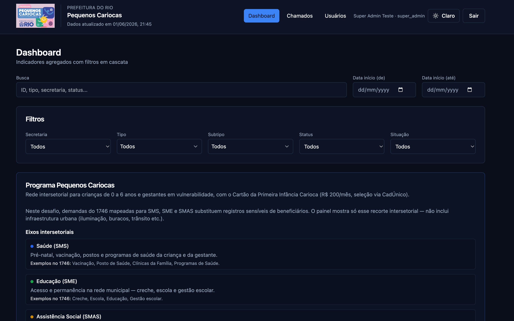

# Desafio Técnico - Tech Lead — Programa Pequenos Cariocas (PIC)

Sistema de monitoramento de chamados **1746**: pipeline dbt → API FastAPI → frontend Next.js.



Decisões técnicas detalhadas: [docs/decisoes.md](docs/decisoes.md)

## Pré-requisitos

- **Python 3.12 ou 3.13** — dependências em [requirements.txt](requirements.txt) (pipeline, backend, BigQuery, testes)
- **Node.js 20+** (frontend)

## Como rodar (centralizado): Quick start (local)

Se ainda não tiver os dados em `data/raw/`, veja [Download de dados no BigQuery](#download-de-dados-no-bigquery).

**Ambiente Python (raiz do repositório):**

```bash
python3.13 -m venv .venv
source .venv/bin/activate
pip install -r requirements.txt
```

### 1. Pipeline

**dbt (a partir de `pipeline/`):**

```bash
cd pipeline
dbt seed    # secretaria_tipo_mapping
dbt run
dbt test
```

**Output:** `data/pic.duckdb`

### 2. Backend

```bash
source .venv/bin/activate
cd backend
DUCKDB_PATH=data/pic.duckdb uvicorn api.main:app --reload --port 8000
```

OpenAPI: [http://localhost:8000/docs](http://localhost:8000/docs)

### 3. Frontend

```bash
cd frontend
npm install
npm run dev
```

UI: [http://localhost:3000](http://localhost:3000)

### Parar e reiniciar serviços

**Parar tudo (dev local — portas 8000 e 3000):**

```bash
kill -9 $(lsof -ti :8000) $(lsof -ti :3000) 2>/dev/null
```

**Reiniciar (dois terminais, na raiz do repo):**

Terminal 1 — backend:

```bash
source .venv/bin/activate
cd backend
DUCKDB_PATH=data/pic.duckdb uvicorn api.main:app --reload --port 8000
```

Terminal 2 — frontend:

```bash
cd frontend
npm run dev
```

## Usuários de teste


| E-mail                                        | Senha | Role        |
| --------------------------------------------- | ----- | ----------- |
| [operador@test.com](mailto:operador@test.com) | test  | operador    |
| [admin@test.com](mailto:admin@test.com)       | test  | admin       |
| [super@test.com](mailto:super@test.com)       | test  | super_admin |


## Download de dados no BigQuery

### Passo a passo

#### 1. Projeto GCP e billing

1. [Google Cloud Console](https://console.cloud.google.com/) — criar/selecionar projeto
2. Vincular conta de faturamento

#### 2. `gcloud` (macOS)

```bash
brew install --cask google-cloud-sdk
source "$(brew --prefix)/share/google-cloud-sdk/path.zsh.inc"

gcloud auth login
gcloud auth application-default login
gcloud config set project <PROJECT_ID>
gcloud auth application-default set-quota-project <PROJECT_ID>
```

#### 3. Download

Extraia somente o bruto no BigQuery (data_particao >= '2023-01-01').

```bash
source .venv/bin/activate

python pipeline/scripts/extract_bigquery.py --billing-project <PROJECT_ID>
```

### Schemas

```bash
source .venv/bin/activate

python pipeline/scripts/generate_schema_docs.py --billing-project <PROJECT_ID>
```

Gera [docs/bigquery_schemas.md](docs/bigquery_schemas.md) (colunas, tipos e descrições das 5 tabelas acima).

## Testes (local)

```bash
# Pipeline
cd pipeline && dbt test

# Backend
cd backend && PYTHONPATH=. pytest tests/ -v

# Frontend
cd frontend && npm run lint && npm run build
```

## CI (GitHub Actions)

Dispara em **push** e **pull request** para `main` / `master`.

| Job | O que roda |
|-----|------------|
| **backend** | `ruff check backend/` + `pytest` (auth e RBAC; sem DuckDB) |
| **frontend** | `npm ci`, `npm run lint`, `npm run build` (Node 20) |

NOTE: os commits estao todos padronizados.