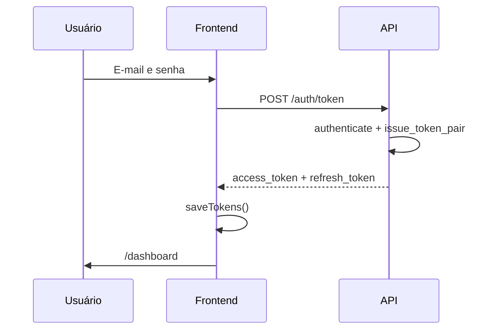
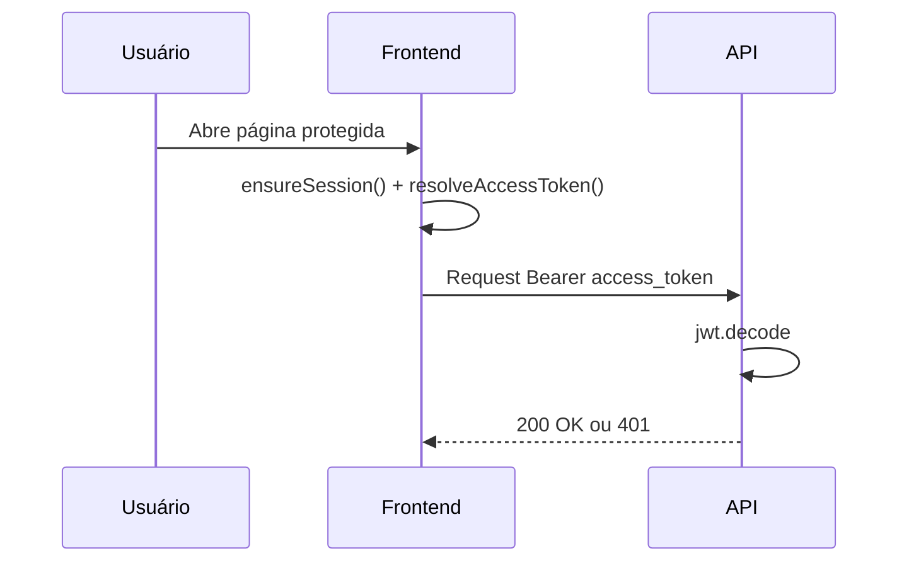
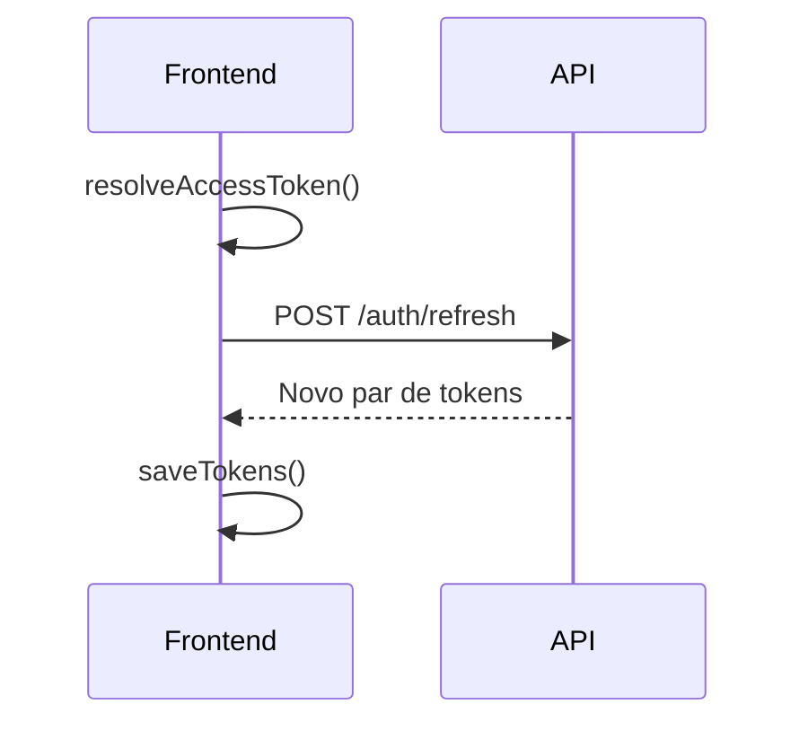
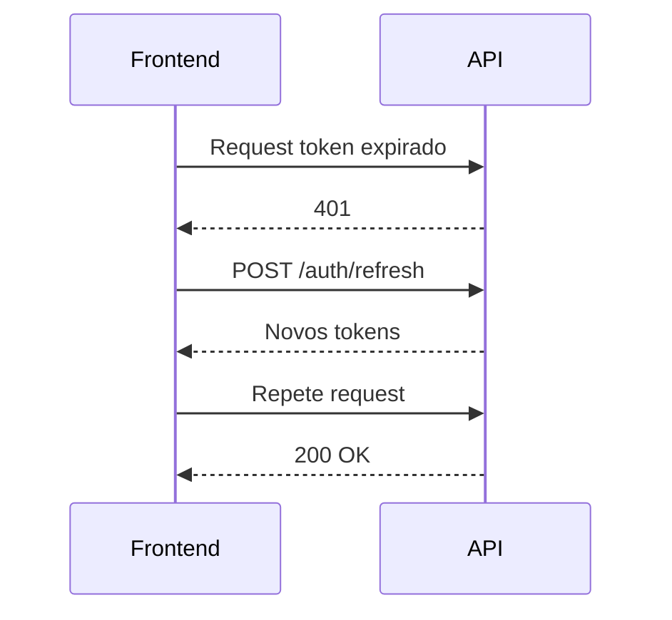
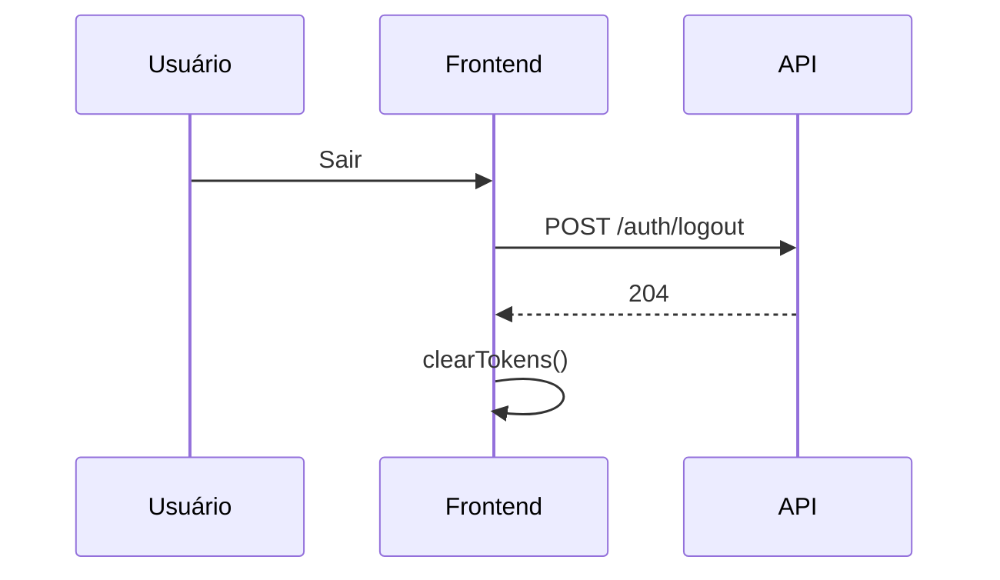

# Decisões Técnicas

Documento de **por quê** (tradeoffs e escolhas).

- [`pipeline/README.md`](../pipeline/README.md) — arquitetura (fluxo BQ → dbt → DuckDB), modelagem e ER, tabelas `main_mart`, métricas, testes dbt
- [`backend/README.md`](../backend/README.md) — variáveis de ambiente, contrato da API (endpoints, query params, tabelas dbt), autenticação mock
- [`frontend/README.md`](../frontend/README.md) — stack, variáveis de ambiente, arquitetura e estrutura de arquivos, `api-client.ts`, páginas (`/login`, `/dashboard`, `/chamados`, `/usuarios`), tema claro/escuro

## 1. Escolhas tecnológicas

### Pipeline
| Decisão | Alternativas | Por quê |
|---|---|---|
| dbt + DuckDB | dbt + SQLite, scripts Polars | <ul><li>DuckDB eh analitico</li><li>dbt testa contratos</li></ul> |
| Download via `basedosdados` (`read_sql`) | Client `google-cloud-bigquery` direto, `bq` CLI | <ul><li>Biblioteca oficial do ecossistema **dados.rio**</li><li>`read_sql` resolve autenticação + billing (`billing_project_id`) num único passo e retorna DataFrame pronto para gravar Parquet</li><li>Abstrai o boilerplate do client BigQuery (job, slots, paginação)</li></ul> |
| Seed CSV para `tipo`→`secretaria` | CASE inline no SQL | Versionável sem alterar SQL |
| Snapshot de schema BQ (`generate_schema_docs.py`) | `SELECT *` no console | Valida nomes e descricoes|

### API
| Decisão | Alternativas | Por quê |
|---|---|---|
| FastAPI + Polars | Flask + pandas | Tenho experiência com Flask + pandas, mas gostaria de aprender mais sobre FastAPI + Polars |
| cachetools TTL | Redis | Suficiente para dev/demo |
| JWT | Keycloak obrigatório | Mais simplificado; não tenho experiência com Keycloak |

### Frontend
| Decisão | Alternativas | Por quê |
|---|---|---|
| Next.js 14 App Router | Vite + React | Sugestão do desafio |
| TanStack Query | useEffect + fetch | Sugestão do desafio |
| Auth via backend (localStorage tokens) | NextAuth | Challenge exige validação JWT no backend |

### Autenticação
| Decisão | Alternativas | Por quê |
|---|---|---|
| Mock IdP in-process | Keycloak Docker | Regras RBAC testáveis sem infra extra |
| Refresh token com jti + blocklist | Stateless only | Permite logout/revogação |

### Autenticação — fluxo completo

Ciclo: **login → validação de token → refresh → logout**. Backend: [`api/routers/auth.py`](../backend/api/routers/auth.py), [`api/auth/jwt_validator.py`](../backend/api/auth/jwt_validator.py). Frontend: [`lib/api-client.ts`](../frontend/lib/api-client.ts) (`ensureSession`, refresh proativo 5 min antes do `exp` via decode JWT no client).

| Etapa | Endpoint / componente |
|-------|------------------------|
| Login | `POST /auth/token` |
| Validação | `get_current_user` — JWT exp, assinatura, iss, aud |
| Check auth | `GET /auth/check` ou `GET /api/v1/auth` |
| Refresh | `POST /auth/refresh` (rotação por `jti`) |
| Logout | `POST /auth/logout` |
| Perfil | `GET /auth/me` |

**Login**



**Validação de token**



**Refresh proativo** (≤ 5 min para `exp`):



**Refresh reativo** (401):



**Logout**



- **access_token** — Bearer em todo request; ~1 h (mock HS256).
- **refresh_token** — só em `/auth/refresh` e `/auth/logout`; ~24 h; revogação por `jti`.

## 2. Modelagem: `tipo` → `secretaria`

| `tipo` | `secretaria` | Confiança | Notas |
|---|---|---|---|
| Saúde, Vacinação, Posto de Saúde | SMS | alta | Domínio saúde |
| Educação, Escola, Creche | SME | alta | Domínio educação |
| Assistência Social, CadÚnico, Abrigo | SMAS | alta | Domínio assistência |

**Tipos omitidos da tabela:**

- **Iluminação, Buraco, Lixo, Árvore** — infraestrutura urbana; fora do filtro PIC (Saúde, Educação, Assistência Social).
- **Denúncia** — rótulo genérico de confiança baixa.

### 2.1. Validação de schema BigQuery (`generate_schema_docs.py`)

Antes de baixar ~4,9M linhas de `chamado`, gerei os schemas das colunas reais no datalake municipal (`datario`), para cruzar com o enunciado do desafio.

#### Como executei

```bash
source .venv/bin/activate
pip install -r requirements.txt   # se ainda não instalado

python pipeline/scripts/generate_schema_docs.py --billing-project desafio-tech-lead-cidadaos
```

Output: [`docs/bigquery_schemas.md`](bigquery_schemas.md)

#### O que o script faz

1. Catálogo das cinco tabelas citadas no enunciado:
2. Para cada tabela, executa SQL em `INFORMATION_SCHEMA.COLUMNS` + `COLUMN_FIELD_PATHS` (via **basedosdados** `read_sql`).
3. Monta Markdown com **nome**, **tipo** e **descrição oficial**

#### Por que foi útil (problema do enunciado × datalake real)

Na prática o datalake **datario** (maio/2026) não é um espelho literal do texto do enunciado.

O enunciado cita a coluna `prazo_atendimento`, mas no `datario` o campo equivalente chama-se **`data_alvo_finalizacao`** (data prevista de atendimento).


## 3. Agregações do dashboard (dbt vs API)

### Comportamento da API

Implementação: `backend/api/services/dashboard.py` (`DashboardService.get_dashboard`).

| Cenário | Leitura | Recalcula agregação? |
|---------|---------|----------------------|
| **Sem filtros** (`q`, tipo, secretaria, datas, etc.) | `SELECT *` nos marts `mart_dashboard_pic_*` (+ `mart_dashboard_by_secretaria`, `mart_dashboard_top_tipos_pic`) | **Não** — só lê tabelas materializadas pelo dbt |
| **Com qualquer filtro ativo** | SQL parametrizado sobre `main_mart.mart_chamados` (`_from_filtered_sql`) | **Sim, sob demanda** — mesma expressão dos marts (COUNT, FILTER, GROUP BY), escopo reduzido pelo `WHERE` |

Detecção de filtro: `has_active_filters()` em `api/services/chamados_query.py` (mesmos parâmetros da listagem e dos filtros em cascata).

## 4. Controle de acesso

### Usuários de teste

Credenciais para `POST /auth/token` e login no frontend. Senha **`test`** para todos; seed em `backend/api/rbac/service.py`.

| E-mail | Senha | Papel |
|--------|-------|-------|
| `operador@test.com` | `test` | `operador` |
| `admin@test.com` | `test` | `admin` |
| `super@test.com` | `test` | `super_admin` |

### Hierarquia

```
operador (0) < admin (1) < super_admin (2)
```

Implementação: `api/rbac/models.py` (`Role`, `ROLE_HIERARCHY`) e `api/rbac/service.py` (`can_grant_role`, `grant_role`, `revoke_role`). Enforcement HTTP: `api/auth/dependencies.require_role` nos routers.

## 5. Tradeoffs e dívida técnica

### Escopo de produto e tempo de entrega

| Item | Planejado | Entregue | Por quê / impacto |
|------|-----------|----------|-------------------|
| **Dashboard por secretaria** | Várias abas (ex.: SMS, SME, SMAS), cada uma com KPIs e gráficos próprios | Uma aba **Dashboard** com filtro intersetorial PIC, filtros em cascata e blocos territoriais/alocação na mesma página | **Tempo** foi o principal limitante: implementar tudo o que se queria (pipeline completo, auth/RBAC, export, múltiplas visões) competiu com dividir o frontend em mais superfícies. Priorizei um dashboard único coerente com os marts antes de fragmentar por eixo. |

### Ambiente local

Gostaria de ter preparado o ambiente em **Docker Compose** — um `docker compose up` subindo pipeline (dbt), API e frontend, com volumes para `data/pic.duckdb` e variáveis já configuradas.

### Contexto de negócio

O programa PIC e o dataset 1746 vi pela primeira vez usando a documentação pública. Vejo que as entregas deveriam ter algum stackholder para avaliar se faz sentido o que estou entregando agora.

### Warnings nos testes de backend

Ao rodar `pytest tests/` no backend, os testes **passam** (26 passed), mas há **48 warnings** que **não deu tempo de validar. Pelo que observei até agora: a maioria é `InsecureKeyLengthWarning` do PyJWT.


## 6. Integração Keycloak

**Hoje:** Resource Owner Password via `POST /auth/token`, JWT HS256 com `JWT_SECRET`, refresh/logout no backend (`jti` + blocklist). Atende o §5 do desafio com IdP mockado.

**Produção (alvo):** Authorization Code + PKCE no frontend; access token RS256 emitido pelo Keycloak; backend valida com JWKS (`iss`, `aud`). O campo `AUTH_MODE=keycloak` em `config.py` está previsto; a branch JWKS em `jwt_validator.py` ainda **não está implementada** (checklist abaixo).

| Componente | Mock | Keycloak |
|------------|------|----------|
| Login | Form → `POST /auth/token` | Redirect → code → token endpoint |
| Validação API | HS256 + secret local | RS256 + `OIDC_JWKS_URL` |
| Refresh | `POST /auth/refresh` | Token endpoint IdP |
| Logout | `POST /auth/logout` | Logout OIDC + revogação IdP |
| RBAC | `require_role` + `ROLE_HIERARCHY` | Igual (claim `role` ou mapper) |

**Backend (checklist)**

1. `jwt_validator.py`: mock HS256 hoje; Keycloak → `PyJWKClient` + RS256.
2. Em produção: desabilitar ou restringir `/auth/token`, `/auth/refresh`, `/auth/logout` mock.
3. Manter `GET /auth/me` e `GET /api/v1/auth` (check Bearer).
4. `get_current_user`: usuário por `sub`; roles alinhadas ao IdP.

**Frontend (checklist)**

1. Redirect ao authorization endpoint Keycloak (PKCE S256) e troca de `code` por tokens.

Passos de implantação:

1. Realm `pic`; realm roles `operador`, `admin`, `super_admin`.
2. Client `pic-frontend` (public, PKCE); client `pic-api` como audience/resource.
3. Protocol mapper: claim `role` no access token (ou parse `realm_access.roles`).
4. Backend: `PyJWKClient` em `decode_token` quando `AUTH_MODE=keycloak`; desativar emissão HS256 em produção.
5. Frontend: redirect OAuth + logout OIDC (substituir formulário e-mail/senha).

Alinhamento municipal: mesmo contrato `Authorization: Bearer` que [check-auth dados.rio](https://docs.dados.rio/api-reference/authentication/check-auth).

Referências: [Keycloak Securing apps](https://www.keycloak.org/docs/latest/securing_apps/), [PyJWT PyJWKClient](https://pyjwt.readthedocs.io/en/stable/usage.html#retrieve-from-jwks-endpoint), [FastAPI OAuth2 JWT](https://fastapi.tiangolo.com/tutorial/security/oauth2-jwt/), [dados.rio intro](https://docs.dados.rio/introduction).

## 7. Cache e concorrência (API)

### Cache da API — `cache_ttl_seconds` / `CACHE_TTL_SECONDS`

Atende o pré-requisito *«Cache: o dataset não deve ser relido da fonte a cada requisição»*.

| Item | Decisão |
|------|---------|
| **O que é** | TTL (segundos) das entradas no `TTLCache` (`backend/api/cache.py`), lido de `Settings.cache_ttl_seconds` |
| **Default** | `600` (10 min) — configurável sem alterar código |
| **O que fica em cache** | Respostas já calculadas de listagem, filtros em cascata e dashboard (objetos Pydantic), chaveada por prefixo + hash dos query params |
| **O que não cacheia** | Export (`/api/v1/export`) — pode retornar conjunto grande filtrado |
| **Primeira leitura** | `factory()` executa SQL no DuckDB (ou lê marts no dashboard sem filtro); hits no TTL não repetem a query |
| **Invalidação** | Automática pelo TTL; `clear_cache()` existe mas não é ligado ao lifespan — após refresh do pipeline, reiniciar API ou aguardar expiração |

### Concorrência DuckDB — conexão compartilhada e thread-safety

**Problema observado:** o frontend dispara requisições **em paralelo** ao mudar filtros — por exemplo `GET /api/v1/dashboard?...` e `GET /api/v1/chamados/filters?...` no mesmo instante (TanStack Query no dashboard e em chamados). O uvicorn atende esses endpoints em **threads distintas** no mesmo worker. A API `DuckDBPyConnection` **não é thread-safe**: se uma thread chama `execute()` enquanto outra ainda não consumiu o resultado anterior (ex.: `.arrow()`), DuckDB levanta:

```text
_duckdb.InvalidInputException: Invalid Input Error: There is no query result
```

**Correção:** `threading.Lock` em `DuckDBReader.fetch_df`.

## 8. Além do enunciado

Itens que o desafio não exigia explicitamente.

**Pipeline de dados**

- Enriquecimento geo (`id_bairro` + join espacial por coordenadas) e export das cinco tabelas `dados_mestres` além de `chamado`
- Filtro PIC (`SMS`, `SME`, `SMAS`) e dezenas de marts além do mínimo (KPIs + temporal + por secretaria): backlog, composição SLA, top tipos, territorial, atrasos por subprefeitura/região × secretaria, órgão executor, pressão por reclamações, categoria
- Script `generate_schema_docs.py` e `docs/bigquery_schemas.md` para validar colunas

**API**

- Lock de concorrência na conexão DuckDB (corrida entre `/dashboard` e `/chamados/filters` em paralelo)

**Frontend**

- Tema claro/escuro e indicador de atualização dos dados
- Card guia do Programa Pequenos Cariocas
- Painel **Alocação de recursos** (gráficos territoriais, atrasos por secretaria, pressão de reclamações, categoria) além dos quatro KPIs/série exigidos
- Composição SLA (donut), cards de backlog e ranking de tipos

**OPS**

- CI (`.github/workflows/ci.yml`: pytest auth/RBAC, lint/build frontend)
- READMEs por camada (`pipeline/`, `backend/`, `frontend/`)