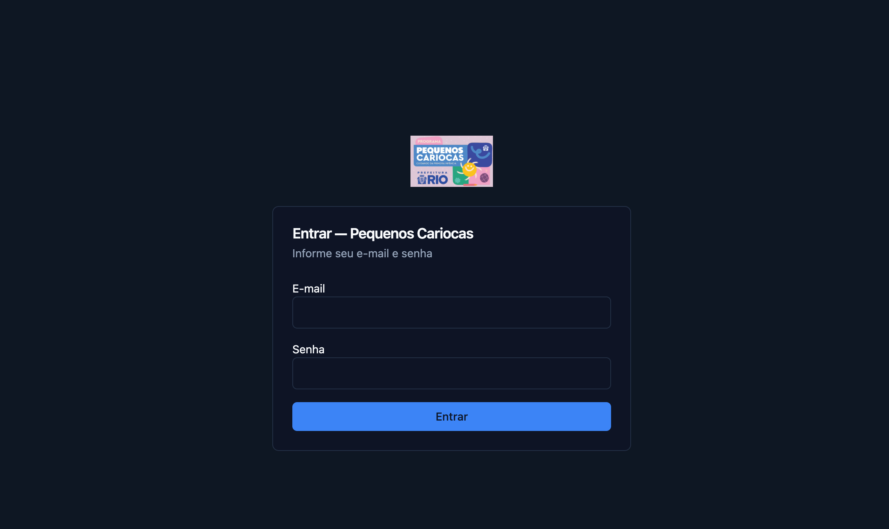
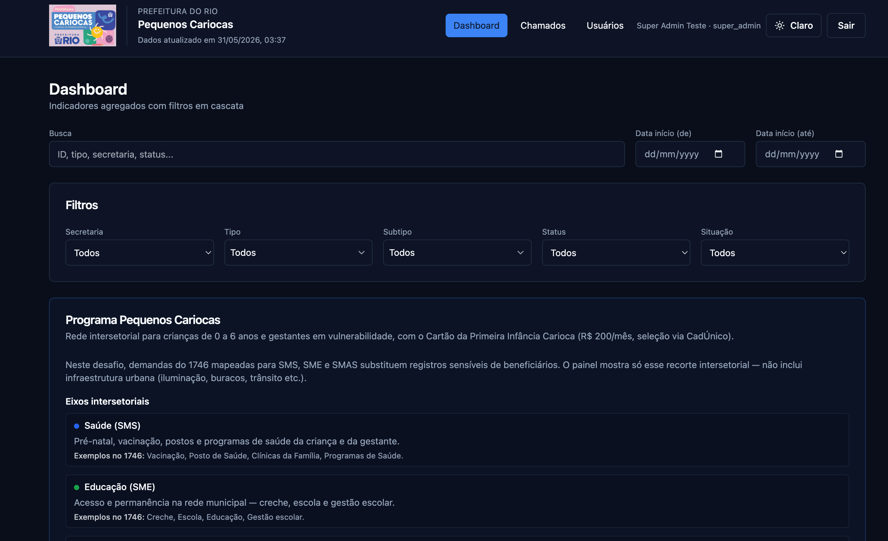
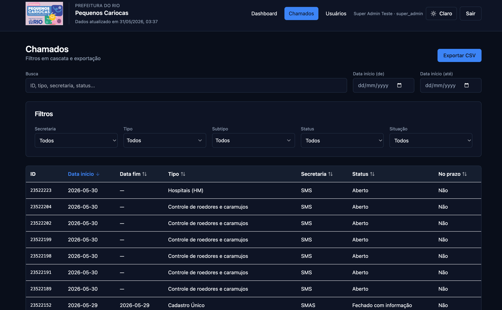
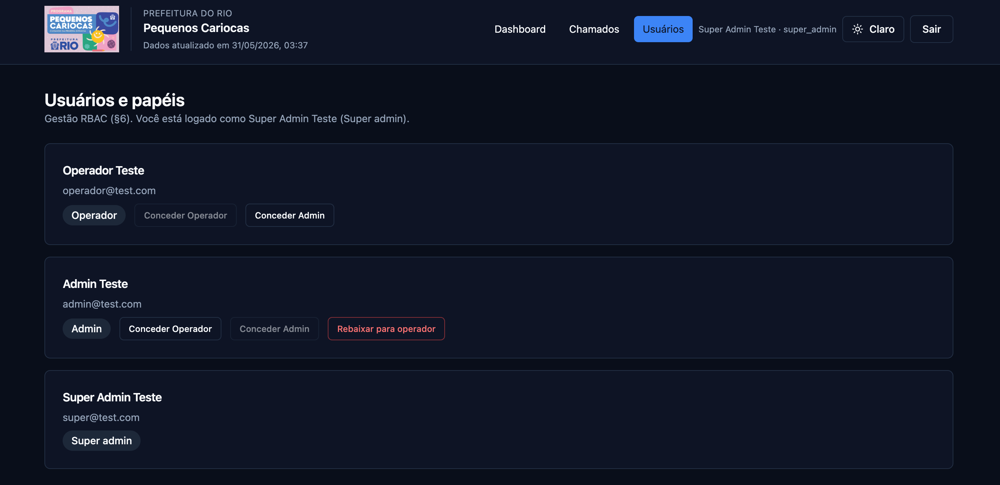

# Frontend

## Stack

| Camada    | Tecnologia                                                         |
| --------- | ------------------------------------------------------------------ |
| Framework | Next.js 14 (App Router)                                            |
| UI        | Tailwind CSS + componentes hand-rolled (`button`, `card`, `input`) |
| Dados     | TanStack Query (cache, refetch, estado de loading)                 |
| Gráficos  | Recharts                                                           |
| Tema      | `next-themes` (claro/escuro)                                       |
| Ícones    | lucide-react                                                       |


## Variáveis de ambiente


| Variável              | Default                 | Descrição       |
| --------------------- | ----------------------- | --------------- |
| `NEXT_PUBLIC_API_URL` | `http://localhost:8000` | URL base da API |


---

## Arquitetura

```
Browser
  │
  ├─ app/              rotas
  ├─ components/       UI
  └─ lib/api-client.ts Cliente HTTP + auth
         │
         ▼
       FastAPI
         │
         ▼
      DuckDB
```

NOTE: O frontend **nunca** lê dados transformados diretamente. Toda filtragem, ordenação, paginação e exportação passam pela API.

---

## Estrutura de arquivos

```
frontend/
├── app/                                    # App Router (rotas)
│   ├── layout.tsx                          # Layout raiz: metadata, Providers, globals.css
│   ├── page.tsx                            # `/` → redirect `/dashboard`
│   ├── globals.css                         # Tokens CSS (claro/escuro) + variáveis de gráfico
│   ├── icon.png · apple-icon.png           # Ícones do app (convenção Next.js)
│   ├── login/page.tsx                      # Autenticação (e-mail/senha)
│   ├── dashboard/
│   │   ├── page.tsx                        # Shell + `DashboardContent`
│   │   └── dashboard-content.tsx           # Filtros, query do dashboard, loading/erro
│   ├── chamados/page.tsx                   # Listagem paginada + export CSV
│   └── usuarios/page.tsx                   # RBAC: concessão/revogação de papéis (admin+)
│
├── components/
│   ├── providers.tsx                       # ThemeProvider + QueryClientProvider
│   ├── providers/auth-provider.tsx         # Contexto do usuário logado + papéis
│   ├── brand-logo.tsx                      # Logo PIC (header e login)
│   ├── theme-toggle.tsx                    # Alternância claro/escuro
│   ├── layout/
│   │   ├── app-shell.tsx                   # Header, nav, guard de sessão, logout
│   │   └── data-freshness.tsx              # Indicador de atualização dos dados
│   ├── dashboard/
│   │   ├── dashboard-view.tsx              # KPIs, evolução temporal, SLA, tipos
│   │   ├── pic-dashboard-guide.tsx         # Card guia Programa Pequenos Cariocas
│   │   ├── dashboard-allocation-section.tsx # Alocação territorial (subpref/região)
│   │   ├── dashboard-territorial-charts.tsx # Gráficos de atrasos e empilhamento
│   │   ├── dashboard-atrasos-por-secretaria-card.tsx
│   │   ├── dashboard-pressao-reclamacoes-card.tsx
│   │   └── dashboard-categoria-card.tsx    # Tipo de chamado (categoria 1746)
│   ├── chamados/
│   │   └── chamados-view.tsx               # Tabela, ordenação, paginação, export
│   ├── filters/
│   │   ├── chamados-filters.tsx            # Filtros em cascata + intervalo de datas
│   │   ├── chamados-search-bar.tsx         # Busca `q` + datas (dashboard e chamados)
│   │   └── active-filter-chips.tsx         # Chips dos filtros ativos
│   └── ui/
│       ├── button.tsx                      # Botão (variantes)
│       ├── card.tsx                        # Card, CardHeader, CardTitle, CardContent
│       ├── input.tsx                       # Input de formulário
│       └── filter-combobox.tsx             # Combobox para filtros com busca
│
├── lib/
│   ├── api-client.ts                       # HTTP, auth, tipos da API, RBAC usuários
│   ├── pic-context.ts                      # Textos PIC (KPIs, guias, cores secretarias)
│   ├── chamados-filter-utils.ts            # Estado/URL dos filtros compartilhados
│   ├── format-data-meta.ts                 # Formatação de metadados (ex.: atualizado em)
│   └── utils.ts                            # `cn()` — merge de classes Tailwind
│
├── public/
│   └── logo-pequenos-cariocas.png
│
├── .env.example
├── next.config.js
├── tailwind.config.ts
├── tsconfig.json
├── postcss.config.js
└── package.json
```

### `lib/api-client.ts`


| Função                 | Endpoint                             | Uso                                  |
| ---------------------- | ------------------------------------ | ------------------------------------ |
| `login()`              | `POST /auth/token`                   | Login                                |
| `logout()`             | `POST /auth/logout`                  | Revoga refresh token + limpa storage |
| `ensureSession()`      | `POST /auth/refresh` (se necessário) | Restaura sessão no mount             |
| `getDashboard()`       | `GET /api/v1/dashboard`              | KPIs e séries                        |
| `getChamados()`        | `GET /api/v1/chamados`               | Lista paginada                       |
| `getChamadosFilters()` | `GET /api/v1/chamados/filters`       | Opções de filtro em cascata          |
| `exportChamados()`     | `GET /api/v1/export`                 | Download CSV                         |
| `listUsers()`          | `GET /api/v1/users`                  | Listagem RBAC (admin+)               |
| `grantUserRole()`      | `POST /api/v1/users/{id}/roles`      | Conceder papel                       |
| `revokeUserRole()`     | `DELETE /api/v1/users/{id}/roles`    | Rebaixar para operador               |


NOTE: Renova o access token **5 min antes** do `exp` (decodifica JWT no client)

---

## Páginas e fluxo com suas features

### `/` → redirect `/dashboard`

Usuário autenticado ou não cai no dashboard (que redireciona para login se a sessão for inválida).

### `/login`

**Arquivo:** `app/login/page.tsx`



Formulário e-mail/senha → `POST /auth/token` → `saveTokens()` → redirect `/dashboard`.

### `/dashboard`

**Arquivos:** `app/dashboard/page.tsx` + `components/dashboard/dashboard-view.tsx`



**Comportamento:**

- Sem filtros → API lê marts pré-agregados (dbt)
- Com filtros → API recalcula KPIs sobre `mart_chamados`
- Botão **Limpar filtros** aparece quando há filtro ativo

### `/chamados`

**Arquivos:** `app/chamados/page.tsx` + `components/chamados/chamados-view.tsx`



Tabela paginada, filtros em cascata, busca `q`, ordenação por coluna e export CSV (`GET /api/v1/export`).

### `/usuarios`

**Arquivo:** `app/usuarios/page.tsx` (conteúdo em `UsuariosContent`, mesma página)



Visível no menu **Usuários** apenas para `admin` e `super_admin` (`AppShell` + `useAuth().isAdmin`). Operadores não veem o link; se acessarem a URL diretamente, veem mensagem de acesso restrito.

**Papéis que o ator pode conceder** (sem escalar acima do próprio nível):


| Ator logado   | Botões de concessão  |
| ------------- | -------------------- |
| `super_admin` | Operador, Admin      |
| `admin`       | Operador             |
| `operador`    | — (página bloqueada) |


**Comportamento:**

- Não é possível alterar o próprio usuário (sem botões no card do ator).
- **Rebaixar para operador** aparece para usuários que não são `operador` (revoga papéis elevados via API).
- Erros de escalação de privilégio vêm do backend (403); a UI só oferece papéis permitidos ao ator.
- Após conceder/revogar, invalida a query `["users"]` e recarrega a lista.

---

## Tema claro/escuro

- Tokens em `app/globals.css` (`:root` e `.dark`)
- Toggle em `components/theme-toggle.tsx` (header e login)

---

## Atendimento aos requisitos de frontend


| Requisito                        | Implementação                                                            |
| -------------------------------- | ------------------------------------------------------------------------ |
| Consome a API (não acessa banco) | `lib/api-client.ts` + TanStack Query; sem DuckDB/SQL no frontend         |
| Dashboard — volume               | Card “Total de chamados” em `components/dashboard/dashboard-view.tsx`    |
| Taxa resolução no prazo          | Card “Taxa resolução no prazo” no mesmo componente                       |
| Tempo médio de resolução         | Card “Tempo médio de resolução” no mesmo componente                      |
| Evolução temporal                | `LineChart` com `data.temporal`                                          |
| Buscar chamados                  | `ChamadosSearchBar` query param `q` em `/chamados` e `/dashboard`        |
| Filtrar com cascata              | `ChamadosFilters` → `GET /api/v1/chamados/filters`                       |
| Filtro por data                  | `ChamadosDateRangeFilters`                                               |
| Opções refletem dados da API     | Selects alimentados por `/api/v1/chamados/filters`                       |
| Exportar filtrados               | filtros + ordenação da tabela                                            |
| Controle de acesso (RBAC)        | `/usuarios` — listar, conceder e rebaixar papéis (`admin`/`super_admin`) |
| Next.js 14+ App Router           | rotas em `app/login`, `app/dashboard`, `app/chamados`, `app/usuarios`    |
| Entregue: rodando local          | Setup e execução: [README.md](../README.md#3-frontend)                 |


