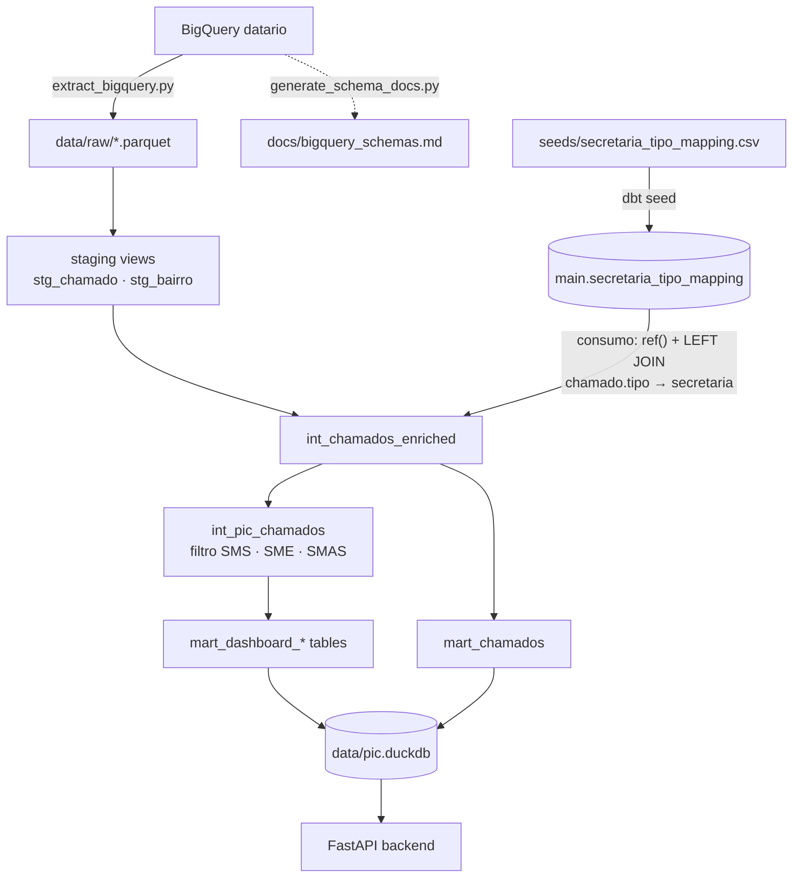
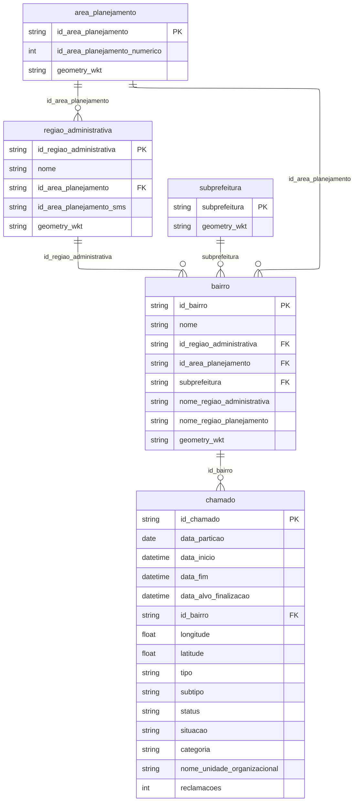
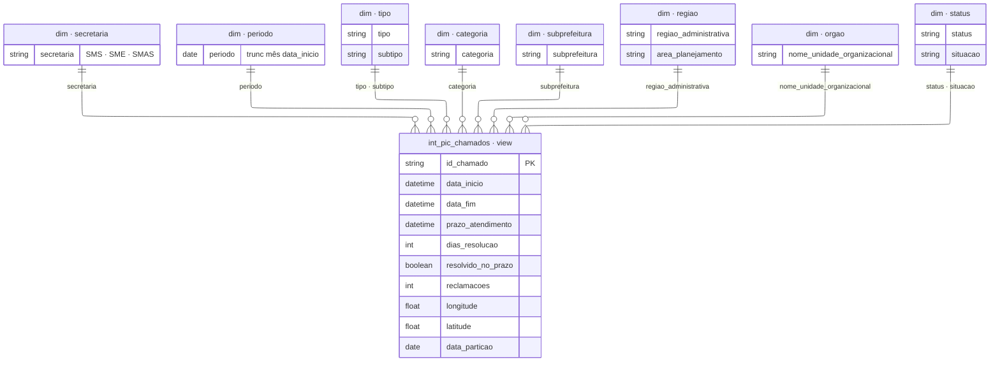

# Pipeline — dbt + DuckDB

Transforma exportações brutas do **1746** (BigQuery `datario`) em marts materializados consumidos pela API (`main_mart.*` em `data/pic.duckdb`).

Decisões de modelagem, recorte PIC, geo join e tradeoffs dbt vs API: [`docs/decisoes.md`](../docs/decisoes.md) (§2, §3, §7).

## Arquitetura



| Camada / artefato | Output | Papel |
|-------------------|-------|-------|
| **`generate_schema_docs.py`** | [`docs/bigquery_schemas.md`](../docs/bigquery_schemas.md) | Snapshot de colunas/tipos/descrições das 5 tabelas `datario` (via `INFORMATION_SCHEMA`); documentação de apoio — **fora do fluxo `extract` → dbt** |
| **Seeds** | `main.secretaria_tipo_mapping` | Mapeamento `tipo` → `secretaria`; **consumido só em** `int_chamados_enriched` |
| **Staging** | `main_staging` (views) | Leitura Parquet, casts, filtro `partition_start` |
| **Intermediate** | `main_intermediate` (views) | Enriquecimento por linha + recorte PIC |
| **Mart** | `main_mart` (tables) | Detalhe (`mart_chamados`) e agregações de dashboard |

**NOTE:** KPIs do dashboard são materializados nos marts PIC; a API lê tabelas pré-agregadas. Filtros interativos no frontend recalculam SQL sobre `mart_chamados` (exceção documentada em `decisoes.md` §3).

### Modelagem

#### Entidade-relacionamento — tabelas BigQuery (`datario`)

Cinco tabelas exportadas por `extract_bigquery.py`. Schemas: [`docs/bigquery_schemas.md`](../docs/bigquery_schemas.md).

Diagrama **entidade-relacionamento** (notação crow's foot do Mermaid). Cada linha lê-se da **esquerda para a direita**.



`chamado` **não** possui FK direta para `regiao_administrativa`, `area_planejamento` ou `subprefeitura` no datalake — o vínculo territorial é **sempre via** `bairro` (modelo em estrela).

## Estrutura do diretório

```
pipeline/
├── dbt_project.yml              # projeto pic_1746, extensão spatial, vars
├── profiles.yml                 # DuckDB → ../data/pic.duckdb
├── models/
│   ├── staging/
│   │   ├── _sources.yml
│   │   ├── stg_chamado.sql
│   │   ├── stg_bairro.sql
│   │   └── stg_regiao_administrativa.sql
│   ├── intermediate/
│   │   ├── int_chamados_enriched.sql   # todos os chamados + geo
│   │   └── int_pic_chamados.sql
│   └── mart/
│       ├── mart_chamados.sql
│       ├── mart_dashboard_by_secretaria.sql
│       ├── mart_dashboard_top_tipos_pic.sql
│       ├── mart_dashboard_pic_*.sql
│       └── schema.yml
├── macros/
│   ├── metrics.sql              # SLA e aggs
│   └── pic_scope.sql            # pic_secretarias_in_clause()
├── seeds/
│   └── secretaria_tipo_mapping.csv
├── scripts/
│   ├── extract_bigquery.py
│   └── generate_schema_docs.py    # gera docs/bigquery_schemas.md
```

Entrada esperada (gitignored):

```
data/raw/
├── chamado.parquet                 # obrigatório
├── bairro.parquet
├── regiao_administrativa.parquet
├── area_planejamento.parquet
└── subprefeitura.parquet
```

Output: `data/pic.duckdb` (path em `profiles.yml`, relativo à raiz do repo).

## Modelagem — tabelas DuckDB (`main_mart`)

| Schema | Materialização | Papel |
|--------|----------------|-------|
| `main_staging` | view | Parquet → casts |
| `main_intermediate` | view | Enriquecimento + `int_pic_chamados` |
| `main_mart` | **table** | Contrato estável para FastAPI |

### Por que tantos marts?

Um mart por visualização evita `GROUP BY` pesado a cada request e deixa o contrato explícito (testes dbt por tabela).

| Mart | Card(s) na UI |
|------|----------------|
| `mart_dashboard_pic_kpis` | Demandas intersetoriais, Encerradas, No prazo (PIC), Tempo médio |
| `mart_dashboard_pic_backlog` | Demandas em aberto, Idade média (abertas) |
| `mart_dashboard_pic_sla_breakdown` | Composição SLA (donut) |
| `mart_dashboard_pic_temporal` | Evolução intersetorial (linhas) |
| `mart_dashboard_by_secretaria` | Por secretaria intersetorial (barras) |
| `mart_dashboard_top_tipos_pic` | Principais tipos intersetoriais |
| `mart_dashboard_pic_by_categoria` | Tipo de chamado (categoria) |
| `mart_dashboard_pic_by_subprefeitura` | Subprefeituras com mais atrasos |
| `mart_dashboard_pic_subprefeitura_x_secretaria` | Total por secretaria em cada subprefeitura (empilhado) |
| `mart_dashboard_pic_atrasos_subpref_por_secretaria` | Secretarias e subprefeituras com mais atrasos (ranking) |
| `mart_dashboard_pic_atrasos_subpref_orgao` | Órgãos executoras no card de atrasos (subpref) |
| `mart_dashboard_pic_by_regiao_atrasos` | Regiões administrativas com mais atrasos |
| `mart_dashboard_pic_regiao_x_secretaria_vol` | Total por secretaria em cada região (empilhado) |
| `mart_dashboard_pic_atrasos_regiao_por_secretaria` | Secretarias e regiões com mais atrasos (ranking) |
| `mart_dashboard_pic_atrasos_regiao_orgao` | Órgãos executoras no card de atrasos (região) |
| `mart_dashboard_pic_pressao_reclamacoes` | Pressão por reclamações (região) |
| `mart_dashboard_pic_pressao_reclamacoes_subprefeitura` | Pressão por reclamações (subprefeitura) |
| `mart_chamados` | Lista/export de chamados; dashboard **com** filtros (não é card fixo) |

### Diagrama dimensional

Dimensões **degeneradas** (colunas na fact table; sem tabelas `dim_*` no DuckDB).



### Métricas

Medidas derivadas em três camadas.

#### Por linha (`int_chamados_enriched`)

Calculadas uma vez por `id_chamado`; os marts e a API (com filtros) reutilizam essas colunas.

| Coluna | Fórmula / regra | Uso |
|--------|-----------------|-----|
| `dias_resolucao` | `date_diff('day', data_inicio, data_fim)` quando ambas preenchidas | Média de tempo de resolução |
| `resolvido_no_prazo` | `data_fim <= prazo_atendimento` quando encerrado **e** `prazo_atendimento` não nulo; senão `false` | Numerador da taxa no prazo; filtro de atraso |
| `secretaria` | `coalesce(seed.tipo → secretaria, 'Outros')` | Recorte PIC e eixos intersetoriais |

#### Condicionais (`macros/metrics.sql`)

Condições booleanas usadas em `filter (where …)` — não são colunas materializadas.

| Macro | SQL equivalente | Significado |
|-------|-----------------|-------------|
| `encerrado_com_sla()` | `data_fim is not null and prazo_atendimento is not null` | Encerrado **com** SLA definido — entra no denominador da taxa no prazo |
| `chamado_atrasado()` | `encerrado_com_sla()` **e** `not resolvido_no_prazo` | Encerrado **fora** do prazo |

#### Agregações (`macros/metrics.sql`)

| Macro | Coluna de saída | Fórmula | Onde aparece |
|-------|-----------------|---------|--------------|
| `agg_taxa_resolucao_prazo_pct()` | `taxa_resolucao_prazo` | `100 × count(resolvido_no_prazo) / count(encerrado_com_sla)` | KPIs, `by_secretaria`, territorial (piores taxas), atrasos × secretaria |
| `agg_chamados_atrasados()` | `chamados_atrasados` | `count(chamado_atrasado())` | Marts de ranking de atrasos por território × secretaria |
| `agg_tempo_medio_resolucao_dias()` | `tempo_medio_resolucao_dias` | `avg(dias_resolucao)` nos encerrados com dias calculados | `mart_dashboard_pic_kpis` |

#### Agregações nos marts (por família)

| Métrica | Definição | Marts / cards |
|---------|-----------|---------------|
| `total_chamados` | `count(*)` no grain | Quase todos os marts PIC |
| `total_resolvidos` | `count(*)` onde `data_fim is not null` | `mart_dashboard_pic_kpis` — card Encerradas |
| `chamados_abertos` | `count(*)` onde `data_fim is null` | `mart_dashboard_pic_kpis`, `mart_dashboard_pic_backlog` — cards Demandas em aberto |
| `total_encerrados` | Igual resolvidos, por `periodo` | `mart_dashboard_pic_temporal` — linha Encerrados |
| `no_prazo` | Encerrados com SLA resolvidos no prazo | `mart_dashboard_pic_sla_breakdown` — donut |
| `fora_prazo` | `chamado_atrasado()` | `mart_dashboard_pic_sla_breakdown` |
| `fechado_sem_prazo` | Encerrado sem `prazo_atendimento` | `mart_dashboard_pic_sla_breakdown` |
| `em_aberto` | `data_fim is null` | `mart_dashboard_pic_sla_breakdown` |
| `idade_media_aberto_dias` | Média de dias desde `data_inicio` até hoje (abertos) | `mart_dashboard_pic_backlog` — Idade média (abertas) |
| `com_reclamacoes_repetidas` | `count(*)` onde `reclamacoes >= 2` | Pressão por reclamações (região / subpref) |
| `pct_do_atraso` | `100 × atrasados do órgão / atrasados do território` (mesma secretaria) | `mart_dashboard_pic_atrasos_*_orgao` — fatia por unidade executora |
| `atualizado_em` | `current_timestamp` no `dbt run` | `mart_dashboard_pic_kpis` → `GET /meta/data` |

## Macros

| Macro | Arquivo | Uso |
|-------|---------|-----|
| `pic_secretarias_in_clause()` | `pic_scope.sql` | `secretaria in ('SMS', 'SME', 'SMAS')` — só em `int_pic_chamados` |
| `encerrado_com_sla()` | `metrics.sql` | Encerrado com prazo definido |
| `chamado_atrasado()` | `metrics.sql` | Encerrado fora do prazo |
| `agg_taxa_resolucao_prazo_pct()` | `metrics.sql` | % no prazo (denominador = encerrados com SLA) |
| `agg_chamados_atrasados()` | `metrics.sql` | Contagem de atrasados |
| `agg_tempo_medio_resolucao_dias()` | `metrics.sql` | Média de `dias_resolucao` |

## Mapeamento `tipo` → `secretaria`

Seed: `seeds/secretaria_tipo_mapping.csv` (`tipo`, `secretaria`, `confianca`, `notas`).

| Secretaria | Eixo PIC | Exemplos de `tipo` |
|------------|----------|-------------------|
| **SMS** | Saúde | Saúde, Vacinação, Posto de Saúde, Clínicas da Família |
| **SME** | Educação | Educação, Escola, Creche, Gestão escolar |
| **SMAS** | Assistência | Assistência Social, CadÚnico, Abrigo, Benefícios |
| **Outros** | Fora do recorte PIC | Iluminação, Buraco na Via, Coleta de Lixo, … |

Após editar o seed:

```bash
dbt seed --full-refresh && dbt run --select int_chamados_enriched+
```

## Testes dbt

Contratos em [`models/mart/schema.yml`](models/mart/schema.yml): garantem chaves, domínio de `secretaria` e colunas mínimas que a API e o dashboard assumem. Rodam com `dbt test`.

### Staging e intermediate

| Modelo | Coluna | Teste |
|--------|--------|-------|
| `stg_chamado` | `id_chamado` | `unique`, `not_null` |
| `stg_chamado` | `data_particao` | `not_null` |
| `int_chamados_enriched` | `id_chamado` | `unique`, `not_null` |
| `int_chamados_enriched` | `secretaria` | `not_null`, `accepted_values` |
| `int_pic_chamados` | `secretaria` | `not_null`, `accepted_values` |

### Marts com testes de coluna

| Modelo | Coluna | Teste |
|--------|--------|-------|
| `mart_chamados` | `id_chamado` | `unique`, `not_null` |
| `mart_dashboard_by_secretaria` | `secretaria` | `not_null`, `accepted_values` |
| `mart_dashboard_pic_kpis` | `total_chamados` | `not_null` |
| `mart_dashboard_pic_temporal` | `periodo` | `not_null` |
| `mart_dashboard_pic_temporal` | `total_chamados` | `not_null` |
| `mart_dashboard_top_tipos_pic` | `tipo` | `not_null` |

## Atendimento aos requisitos do enunciado

| Requisito (enunciado) | Implementação |
|-----------------------|---------------|
| dbt + DuckDB (ou SQLite); transformar bruto em dados utilizáveis; camada de transformação (limpeza, enriquecimento, colunas derivadas) e camada de agregação para o dashboard | **dbt-duckdb** em [`profiles.yml`](profiles.yml) → `data/pic.duckdb`. **Staging** (`models/staging/`: casts, filtro temporal, leitura Parquet). **Intermediate** (`models/intermediate/`). **Mart** (`models/mart/`). |
| Agregações do dashboard nos modelos dbt — API não recalcula a cada requisição | KPIs, séries temporais, territorial, SLA, atrasos e pressão materializados em `models/mart/mart_dashboard_pic_*.sql`. |
| Derivar `secretaria` a partir de `tipo`; explorar valores, definir mapeamento e documentar ambiguidades | Seed [`seeds/secretaria_tipo_mapping.csv`](seeds/secretaria_tipo_mapping.csv) (`tipo` → `SMS` / `SME` / `SMAS` / `Outros`). |
| Modelos dbt funcionando + documentação das decisões de modelagem | Execução: [`README.md`](../README.md#1-pipeline). |
